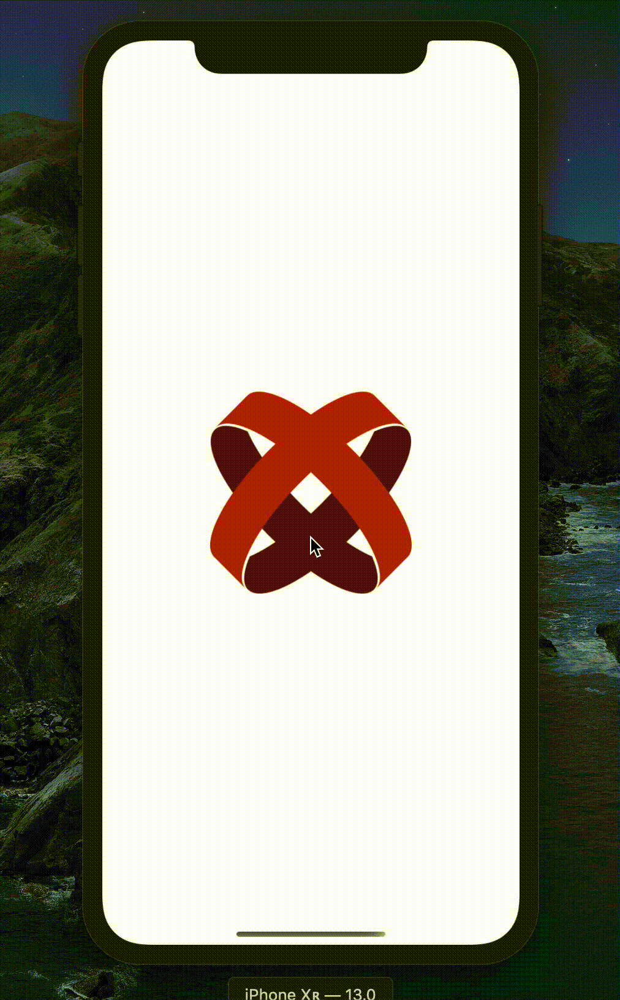

# Titanium iOS 13+ Context Menu

Use the `UIPreviewInteraction` API in the Appcelerator Titanium SDK.



## Requirements

- [x] Titanium SDK 9.2.0+
- [x] iOS 13+ (iOS 14+ for button menus)

## How does it work?

Simply include the `ti.contextmenu` module in your tiapp.xml and call the `addInteraction`
method on any `Ti.UI.View` subclass (e.g. `Ti.UI.ImageView`).

## Full Example

```js
var win = Ti.UI.createWindow({ layout: 'vertical', title: 'Ti.ContextMenu' });
var nav = Ti.UI.createNavigationWindow({ window: win });

var label = Ti.UI.createLabel({ text: 'Long-press the image below:', top: 50 });

var image = Ti.UI.createImageView({
    top: 20,
    width: 200,
    height: 200,
    borderRadius: 10,
    image: 'logo-titanium.png'
});

image.addEventListener('interaction', function(event) {
    alert('Clicked at index: ' + event.index);
});

image.addInteraction({
    identifier: 'main_menu',
    actions: [{
            identifier: 'edit',
            image: Ti.UI.iOS.systemImage('plus.circle'),
            title: 'Edit …'
        },
        {
            identifier: 'delete',
            title: 'Delete',
            destructive: true
        }
    ]
});

const separator = Ti.UI.createView({ height: 1, backgroundColor: '#e0e0e0', top: 40, bottom: 40, width: 300 });

var btn = Ti.UI.createButton({ title: 'Show button options', menu: [{ title: 'Action 1', identifier: '123' }, { title: 'Action 2', identifier: '456', destructive: true }] })

btn.addEventListener('menuclick', function(event) {
    alert('Clicked at index: ' + event.index);
});

win.add([ label, image, separator, btn ]);
nav.open();
```

## Known Issues

- [ ] Add compatibility for ListView & TableView via their delegate methods
- [ ] Add support for nested menus

## License

MIT

## Author

Hans Knöchel
